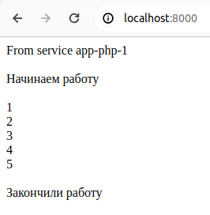
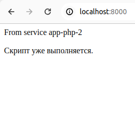
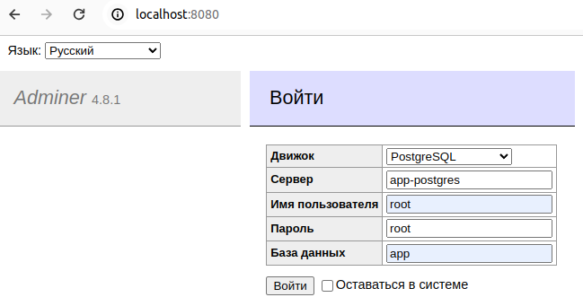

# Тестовое задание

### 1. Задание
- Написать любой скрипт на php,
- который будет выполняться 5 секунд.
- Вшить в этот скрипт защиту от повторного запуска, если он еще не отработал. Использовать Redis.

### 2. Задание
- Создать 4 таблицы на postgres:
  (продукты, категории, статистика, заказы), и заполнить стандартными столбцами на ваш выбор.
- В таблице Заказы добавить колонку с временем покупки.
- Вам необходимо написать триггер на таблицу с заказами: при добавлении новой строки в таблицу с заказами, собирать статистику сколько товаров и какой категории было куплено за день.

---

### 1 Решение:

php скрипт находистся по адресу `public/index.php`

Для запуска кода должны быть установлены:
- Docker
- Docker Compose
- Make

### Команды для управления кода через Make:

```shell
make init   # создаёт образы для запуска контейнеров и запускает контейнеры
make up:    # запускает контейнеры
make down   # останавливает и удаляет контейнеры
make reload # запускает команды (make down) и (make init)
```
### Команды для управления кода через Docker:
```shell
docker compose build --parallel      # создаёт образы для запуска контейнеров
docker compose up -d                 # запускает контейнеры
docker compose down --remove-orphans # останавливает и удаляет контейнеры
```


### Запуск скрипта одновременно в двух раздных вкладках:


  

---

### 2 Решение:

Выполнены первые 2 пункта задания.

Триггер не написан.

Для задания создан дамп sql. При поднятии проекта он загружается в базу данных postgres.

Для доступа к базе данных можно войти в браузере.



Сам файл sql находится по адресу:  
`docker/postgres/database/pgsql-backup.sql`


